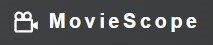
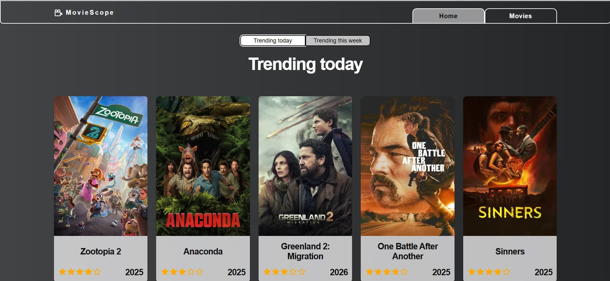
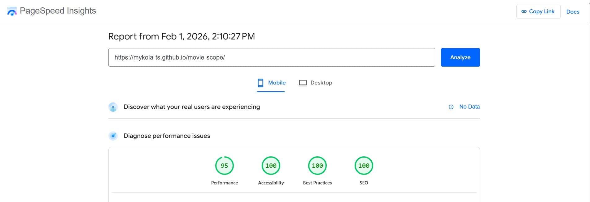
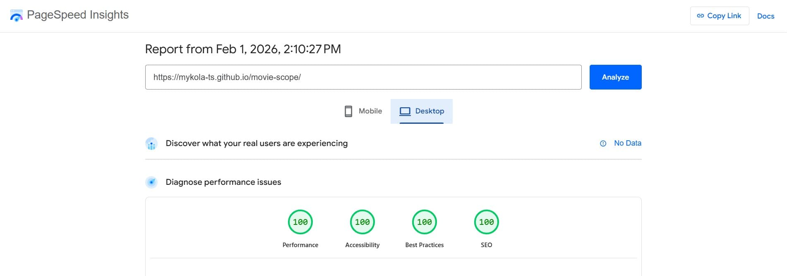

# 🎥 MovieScope

**MovieScope** is an interactive web app that works as a movie discovery and
information tool. On this site, users can search for films, and view detailed
information about them, such as posters, titles, genres, ratings, and more.



## 📑 Table of Contents

- [About the Project](#-about-the-project)
- [Web App Structure](#-web-app-structure)
- [Useful Links](#-useful-links)
- [Technologies Used](#-technologies-used)
- [Libraries Used](#-libraries-used)
- [Folder and File Structure](#-folder-and-file-structure)
- [Features](#-features)
- [PageSpeed Results](#-pagespeed-results)
- [Installation & Setup](#-installation--setup)
- [Author](#-author)

## 📝 About the Project

This project is a responsive multi-page web application developed as a movie
discovery platform. It allows users to browse popular movies, search for
specific titles, and explore detailed information about each film in a clean and
intuitive interface. The application provides a convenient way to discover new
movies and quickly access essential details such as ratings, genres, and
posters.

The app is built with React and modern JavaScript, following a component-based
architecture. It features dynamic data fetching from an external movie API,
real-time search functionality, and a responsive layout that ensures a smooth
and user-friendly experience across different devices and screen sizes.



## 🏗 Web App Structure

The Movie Scope web application consists of four main pages and reusable UI
components that together provide full movie browsing and search functionality.

**📃 Main Pages:**

- **Home Page** — displays a curated list of trending and popular movies. Users
  can browse movies based on the selected trending time window (e.g. Trending
  Today, Trending This Week). Each movie card shows basic information such as
  poster, title, rating, and release year.

- **Movies Page** — provides movie search and discovery functionality. Users can
  search for movies by title or quickly filter results using a list of
  predefined genres. The page displays search results in a paginated movie list.

- **Movie Details Page** — displays comprehensive information about a selected
  movie, including its overview, key metadata (such as release date, rating, and
  genres), and related content. The page serves as a focused view for exploring
  a specific title in detail.

- **Person Details Page** — provides detailed information about a selected film
  industry professional, including personal data (gender, date of birth, place
  of birth), department, popularity score, and a biography. The page also
  includes photos, allowing users to explore the person’s career.

**🧩 Core Elements:**

- **Header** — contains the application name and logo (MovieScope) and
  navigation links (Home, Movies). It is shared across all pages.

- **Trending Time Window Switcher** — located on the Home page, allows users to
  switch between different trending periods to update the displayed movie list.

- **Movies List** — displays a grid of movie cards based on trending data or
  search results. Each item shows the movie poster, title, rating, and release
  year.

- **Movie Search Form** — located on the Movies page, allows users to search for
  movies by name.

- **Genre Filter** — a horizontal list of main movie genres on the Movies page
  that enables quick filtering by a selected genre.

- **Pagination** — allows users to navigate through multiple pages of movie
  results on the Movies page.

- **Movie Details Components** — include sections for movie description,
  additional information, cast, and reviews, providing extended details for a
  selected movie.

- **Reusable UI Components** — shared components such as loaders, buttons (Back
  to Top, Back Link), and layout wrappers are used to maintain consistent UI and
  improve user experience.

## 🔗 Useful Links

- [Live Demo](https://mykola-ts.github.io/movie-scope) — deployed version of the
  web app

- [GitHub Repository](https://github.com/Mykola-Ts/movie-scope) — source code of
  the project

## 🛠 Technologies Used

- HTML5
- CSS3
- JavaScript (ES6+)
- React
- React Router DOM — routing and navigation
- Styled Components — CSS-in-JS styling
- Git / GitHub — version control and collaboration
- ESLint — code linting and style consistency

## 📦 Libraries Used

- [axios](https://axios-http.com/) — promise-based HTTP client;
- [modern-normalize](https://github.com/sindresorhus/modern-normalize) —
- [nanoid](https://www.npmjs.com/package/nanoid) — unique ID generator;
- [react](https://react.dev/) — core library for building user interfaces;
- [react-dom](https://www.npmjs.com/package/react-dom) — DOM-specific methods
  for rendering React components;
- [react-hot-toast](https://react-hot-toast.com/) — beautiful notifications &
  toasts;
- [react-icons](https://react-icons.github.io/react-icons/) — popular icon packs
  for React;
- [react-loader-spinner](https://www.npmjs.com/package/react-loader-spinner) —
  loading spinners for React; normalize default browser styles;
- [react-rating](https://www.npmjs.com/package/react-rating) — customizable
  rating (stars) component for React; library.
- [react-router-dom](https://reactrouter.com/) — routing for React applications;
- [react-scroll-to-top](https://www.npmjs.com/package/react-scroll-to-top?activeTab=versions)
  — scroll-to-top button component for React applications.
- [styled-components](https://styled-components.com/) — CSS-in-JS styling

## 📁 Folder and File Structure

- **.github/**: GitHub-specific configuration and workflows;

- **assets/**: Folder stores images used in the README.md file to visually
  document and represent the project;

- **public**: Contains static assets that are served directly without
  processing. Files inside are copied to the build folder as-is and can be
  accessed by their root path;

- **src/**: The main source folder of the React application. Contains all the
  code, components, assets, and logic of the project:
  - **components/**: Reusable UI components of the application;

  - **fonts/**: Custom fonts used in the project;

  - **helpers/**: Utility functions or helper modules that provide reusable
    logic across the app;

  - **hooks/**: Custom React hooks that encapsulate logic for state, effects, or
    reusable patterns;

  - **img/**: Images and graphic assets used in the application;

  - **pages/**: Page-level components representing different views/routes of the
    app;

  - **services/**: a collection of service modules responsible for handling
    external interactions, such as API requests, data fetching, and
    communication with third-party services;

  - **index.js**: The main entry point of the React app. Renders the root
    component into the DOM (ReactDOM.createRoot).

- **.editorconfig**: Editor configuration file;

- **.gitignore**: Specifies which files and directories to ignore in Git;

- **.prettierrc.json**: Prettier configuration for code formatting;

- **jsconfig.json**: Configuration file for JavaScript/TypeScript in VS Code —
  defines compiler options, path aliases, and IntelliSense settings;

- **package.json**: Contains metadata about the project and dependencies;

- **README.md**: Project documentation and setup instructions;

- **uk_translation.yml**: Translation configuration file — specifies source
  files and where localized (e.g., Ukrainian) translations should be stored.

## 🎯 Features

- **Trending Movies**  
  The homepage displays a curated list of popular movies with the ability to
  switch between daily trending (default) and weekly trending titles.

- **Load More Movies**  
  A Show more button at the bottom of the homepage allows users to load and view
  additional movies without leaving the page.

- **Movie Search**  
  Users can search for movies by title on the /movies page, enabling quick and
  easy content discovery.

- **Genre Filter**  
  The /movies page includes a list of main genres, allowing users to quickly
  find movies by their preferred genre.

- **Pagination**  
  The /movies page includes pagination to browse through large result sets, with
  visibility of the total number of available pages.

- **Movie Details**  
  Each movie has a dedicated details page that provides comprehensive
  information, including:
  - poster image and homepage link;
  - original title and original language;
  - genres and runtime;
  - release date;
  - production countries and companies;
  - budget and revenue;
  - popularity score, average rating, and vote count;
  - movie overview and plot description.

- **Additional Information about movie**  
  The movie details page includes an Additional information section with
  interactive buttons:
  - Show the cast — displays the list of actors and their roles;
  - Show reviews — shows user reviews and feedback.

- **Person Details**  
   Each person has a dedicated details page that provides comprehensive
  information, including:
  - profile photo and basic personal information;
  - full name, gender, and date of birth;
  - place of birth and known-for department (e.g., Acting, Directing);
  - popularity score and professional relevance;
  - biography and career overview;
  - additional photos related to the person.

  This information allows users to explore the individual’s background and
  professional contributions in detail.

- **Scroll to Top Button**  
  Enhances navigation and usability, especially on long or content-heavy pages.
  Appears when scrolling down and allows users to quickly return to the top of
  the page.

- **Keyboard Accessibility**  
  Modal windows and navigation elements support keyboard interactions (e.g., Esc
  to close modals), improving accessibility.

- **Clean & Modular Code**  
  Code is split into logical modules.

- **Performance & Accessibility**  
  The web app achieves high performance, accessibility, best practices, and SEO
  standards. Optimized code and structure ensure fast loading, smooth
  interactions, and an inclusive, user-friendly experience across all devices.

## 🚀 PageSpeed Results

Google's PageSpeed Insights was used to analyze the performance of the main page
of the MovieScope web app on both mobile and desktop devices. The results
indicate strong performance in key areas, providing a smooth user experience for
public users.

- **📱 Mobile Performance:**



- **💻 Desktop Performance:**



These results reflect that the publicly available part of the web app is
optimized for fast loading times and high usability across devices.

## ⚙ Installation & Setup

To run the project locally, follow these steps:

1. **Clone the repository**

   ```bash
   git clone https://github.com/Mykola-Ts/movie-scope.git
   cd movie-scope
   ```

2. **Install dependencies**

   ```bash
    npm install
   ```

3. **Start the development server**

   ```bash
    npm start
   ```

4. **Open in browser**

   Visit http://localhost:3000/movie-scope to view the project.

## 👨‍💻 Author

**Mykola Tsybulskyi**

🔗 GitHub https://github.com/Mykola-Ts

🔗 Email tsybulskiyk@gmail.com

🔗 LinkedIn https://www.linkedin.com/in/mykola-tsybulskyi
